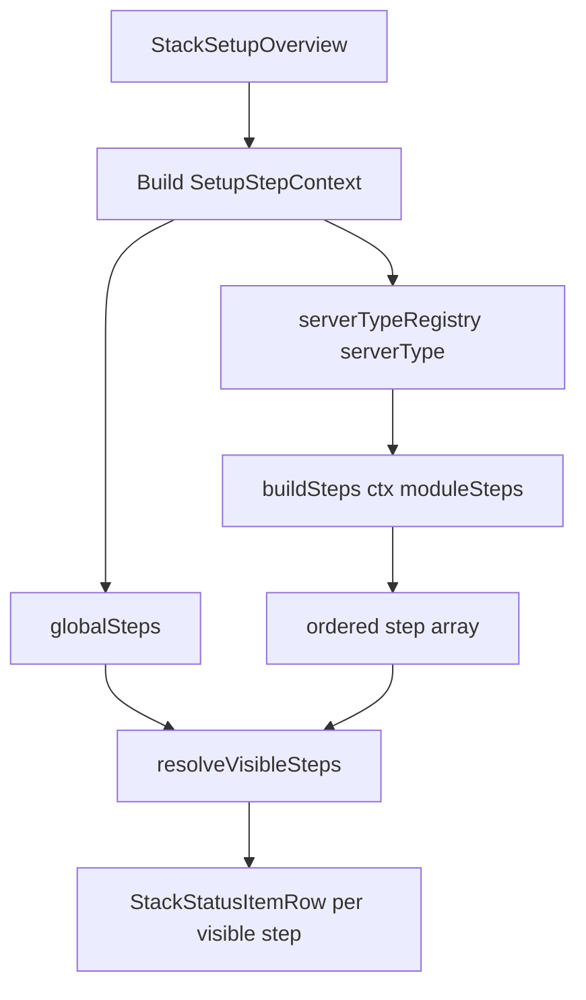

# Plan - Stack setup workflow orchestrator

**Status:** Implemented  
**Scope:** Refactor stack Overview setup notifications into a composable step pipeline: cross-cutting steps, server-type workflows, and shared module steps.  
**Related:** `ServerTypeCatalogOptions`, `ModuleSetupStatusRows`, `IndividualProgressionPlayerbotsSetupHint`, `StackOverviewStatusPanel`.

---

## Problem

Post-deploy setup guidance on the stack Overview tab is implemented ad hoc:

- Module-specific UI is gated by hardcoded module IDs (`mod-individual-progression` triggers a playerbots disable workflow even when `mod-playerbots` is not installed).
- The same SOAP / AH bot / IP logic exists in `ModuleSetupStatusRows` and an unused duplicate `ModuleSetupWarnings`.
- `IndividualProgressionPlayerbotsSetupHint` is a ~440-line monolith (localStorage phases, conf edits, stack start, patch polling) with no reusable step abstraction.
- `IndividualProgression` server type still **requires** `mod-playerbots` in the backend catalog, but operators should be able to run IP with other bot modules (e.g. solo craft) or no bots at all.

We need a structure that is easy to extend per server type and per module without central `if` chains.

---

## Goals

1. **One orchestrator** renders all applicable setup notifications on Overview.
2. **Cross-cutting global onboarding** - the first three setup steps on every stack are always, in order: **SOAP admin**, **upload client**, **upload armory DBC**. Client and armory are **skippable** (recommended but not required); SOAP is required.
3. **Server-type files** define step order and inject module steps at the right position in the pipeline.
4. **Module step factories** live under `steps/modules/` (module-specific, not generic stack ops); server types compose them by module id.
5. **Conditional applicability** is declared on each step (`applies(ctx)`), not in the orchestrator.
6. **Remove `mod-playerbots` as required** for Individual Progression; playerbots steps only appear when that module is installed.

## Non-goals

- Replacing **infra** warnings in `StackOverviewStatusPanel` (Docker disk, VPC SSH, launcher build, stack updates). Client/armory upload prompts **move** from that panel into `global-steps/` as part of this work.
- Moving Patches-tab IP bootstrap/sync UI into Overview steps (Overview may link to Patches; detailed actions stay on Patches tab).
- Backend-driven workflow definitions (frontend-only registry is sufficient for v1).

---

## Architecture

```text
StackOverviewStatusPanel
  └── (infra warnings - unchanged for now)
  └── StackSetupOverview          ← new orchestrator
        ├── globalSteps[]         ← fixed order: SOAP → client → armory DBC (first 3 always)
        └── serverTypeSteps[]     ← from registry[stack.configuration.serverType]
              └── buildSteps(ctx) ← server type composes shared module step factories
                    └── moduleSteps from resolveModuleSteps(installedModuleIds)
```



### Rendering rules

1. Build a single `SetupStepContext` via `useSetupStepContext()` - prefetches all status needed for `applies` / `isComplete` (see [Context and hooks](#context-and-hooks)).
2. Concatenate: `[...globalSteps, ...serverTypeSteps(ctx)]`.
3. Apply [sequencing](#sequencing) so ordered workflows (e.g. Individual Progression + playerbots) show **one primary step at a time**, while independent steps (SOAP, AH bot, dungeon sim notes) may appear in parallel.
4. For each visible step: render one `StackStatusItemRow` using step metadata + `Component`.
5. Completed steps are hidden by default; optional `showWhenComplete` for success states (e.g. SOAP credentials reveal).
6. Step order in the array **is** pipeline order. Server types control sequencing by array construction, not priority numbers.

---

## Folder layout (frontend)

Two kinds of step live under `steps/`:

| Location | Purpose | Examples |
|----------|---------|----------|
| `steps/stack/` | **Generic stack operations** - reusable on any server type, no module-specific business logic | start, stop, restart |
| `steps/modules/` | **Module-specific setup** - custom behaviour tied to a module id (DB injection, conf quirks, patch prep, notes) | AH bot characters, dungeon sim SQL, IP bootstrap |

Cross-cutting steps that are not module-specific and not stack-generic (e.g. SOAP admin) stay in `global-steps/`.

```text
frontend/src/setup/
  types.ts                          # SetupStep, SetupStepContext, SetupWorkflowBuilder
  StackSetupOverview.tsx            # orchestrator used by ModuleSetupStatusRows
  global-steps/
    index.ts                        # exports globalSteps - fixed onboarding order (see below)
    soapAdminStep.tsx               # 1 - required
    uploadClientStep.tsx            # 2 - skippable
    uploadArmoryDbcStep.tsx         # 3 - skippable
  steps/
    index.ts                        # re-exports generic stack step factories
    stack/                          # generic - not tied to a module
      startStackStep.tsx
      stopStackStep.tsx
      restartStackStep.tsx
    modules/                        # module-specific custom setup (one folder per module id)
      index.ts                      # moduleStepRegistry + resolveModuleSteps()
      mod-ah-bot/
        ahBotStep.tsx
      mod-playerbots/
        disablePlayerbotsStep.tsx
        reenablePlayerbotsStep.tsx
        playerbotsStatus.ts         # pure applies/isComplete helpers (vitest)
        usePlayerbotsConf.ts
      mod-individual-progression/
        prepareProgressionStep.tsx
        ipSyncHintStep.tsx
        ipStatus.ts                 # pure helpers (vitest)
        useIpProgressionStatus.ts
      mod-playerbot-dungeon-sim/
        dungeonSimNotesStep.tsx
  server-types/
    index.ts                        # Record<ServerType, SetupWorkflowBuilder>
    standard.setup.ts
    playerbots.setup.ts
    individualProgression.setup.ts
    npcBots.setup.ts
    custom.setup.ts
  progress/
    setupProgressStore.ts           # unified localStorage by stackId + stepId
  useSetupStepContext.ts            # prefetches status for all steps
  resolveVisibleSteps.ts            # independent vs sequenced pipeline resolution
  hasActiveSetupSteps.ts            # useHasActiveSetupSteps - shared with StackOverviewStatusPanel
```

### When to put a step where

- **`global-steps/`** - applies to every stack regardless of server type or modules. **Order is fixed:** SOAP → upload client → upload armory DBC, then any future global steps. Client and armory steps are skippable; SOAP is not.
- **`steps/stack/`** - operates on the stack itself (containers, status transitions); no module catalog knowledge.
- **`steps/modules/{moduleId}/`** - knows about that module’s conf paths, SQL, API calls, or patch workflow. Registered in `steps/modules/index.ts` so `resolveModuleSteps()` can inject them by installed `moduleIds`.
- **`server-types/`** - only **ordering** and **which generic steps** to interleave; imports from `steps/stack/` and receives `moduleSteps` from the registry.

---

## Core types

```typescript
// frontend/src/setup/types.ts

export type SetupStepContext = {
  stack: StackDetailsDto
  patchesHref: string
  onSelectTab: (tab: 'addons' | 'patches' | 'client' | 'armory') => void
  /** Prefetched by useSetupStepContext - keeps applies/isComplete pure */
  status: SetupStepStatus
}

/** Live + persisted state shared across steps (see Context and hooks) */
export type SetupStepStatus = {
  soapInitialized: boolean
  client: {
    dataUploaded: boolean
    containerRunning: boolean
    loading: boolean
  }
  armory: {
    dbcUploaded: boolean
    containerRunning: boolean
    loading: boolean
  }
  playerbots: {
    confPath: string | null
    enabled: boolean | null
    loading: boolean
  }
  individualProgression: {
    bootstrapped: boolean
    syncCompleted: boolean
    loading: boolean
  }
  progress: SetupProgressStore
}

export type SetupStep = {
  /** Stable id for StackStatusItemRow and progress persistence */
  id: string
  /** Owning module id - set on steps from steps/modules/ for filtering in server-type builders */
  moduleId?: string
  /**
   * When true, operator may dismiss the step without completing the underlying action
   * (e.g. upload client / armory DBC). Skipped steps count as complete for visibility.
   * SOAP admin is never skippable.
   */
  skippable?: boolean
  /**
   * When true, this step participates in sequential gating: only the first
   * incomplete step in a pipeline with `sequenced: true` is shown as primary.
   * Independent steps (SOAP, static notes) leave this false/undefined.
   */
  sequenced?: boolean
  /**
   * Optional explicit prerequisites (step ids that must be complete first).
   * Used within a sequenced pipeline; evaluated after `applies`.
   */
  dependsOn?: string[]
  /** Row severity when rendered inside StackStatusItemRow */
  level: 'error' | 'warning' | 'success' | 'loading'
  title: string
  summary: (ctx: SetupStepContext) => string
  /** Return false to skip this step entirely */
  applies: (ctx: SetupStepContext) => boolean
  /** Return true when the operator no longer needs this step - must be pure given ctx.status */
  isComplete: (ctx: SetupStepContext) => boolean
  defaultExpanded?: boolean
  /** Detail panel + actions */
  Component: React.FC<SetupStepContext>
  /** Optional primary row action (alternative to in-panel buttons) */
  action?: (ctx: SetupStepContext) => React.ReactNode
}

/** Server types export a builder that receives resolved module steps */
export type SetupWorkflowBuilder = (
  ctx: SetupStepContext,
  moduleSteps: SetupStep[],
) => SetupStep[]

/** Marks a contiguous slice of steps as one ordered pipeline */
export type SetupPipeline = {
  id: string
  steps: SetupStep[]
}
```

### Step factory pattern

**Generic stack steps** are factory functions under `steps/stack/`:

```typescript
// steps/stack/startStackStep.ts
export function startStackStep(options?: { label?: string; when?: (ctx: SetupStepContext) => boolean }): SetupStep {
  return {
    id: 'start-stack',
    applies: (ctx) => options?.when?.(ctx) ?? canStartStack(ctx.stack),
    isComplete: (ctx) => ctx.stack.status === StackStatus.Running,
    // ...
  }
}
```

**Module steps** live in `steps/modules/{moduleId}/` and export factories for that module only:

```typescript
// steps/modules/mod-playerbots/disablePlayerbotsStep.ts
export function disablePlayerbotsStep(options?: { requiredBeforePatches?: boolean }): SetupStep {
  return {
    id: 'mod-playerbots-disable',
    applies: (ctx) =>
      ctx.stack.configuration.moduleIds?.includes('mod-playerbots') ?? false,
    isComplete: (ctx) => /* playerbots disabled OR setup marked complete */,
    // ...
  }
}
```

Each module folder has a small barrel that lists its steps:

```typescript
// steps/modules/mod-ah-bot/index.ts
export function ahBotModuleSteps(): SetupStep[] {
  return [ahBotStep()]
}
```

The module registry maps module id → step list (wired once in `steps/modules/index.ts`):

```typescript
// steps/modules/index.ts
import { ahBotModuleSteps } from './mod-ah-bot'
import { playerbotsModuleSteps } from './mod-playerbots'
import { individualProgressionModuleSteps } from './mod-individual-progression'
import { dungeonSimModuleSteps } from './mod-playerbot-dungeon-sim'

const moduleStepRegistry: Record<string, () => SetupStep[]> = {
  'mod-ah-bot': ahBotModuleSteps,
  'mod-playerbots': playerbotsModuleSteps,
  'mod-individual-progression': individualProgressionModuleSteps,
  'mod-playerbot-dungeon-sim': dungeonSimModuleSteps,
}

export function resolveModuleSteps(moduleIds: string[]): SetupStep[] {
  const steps: SetupStep[] = []
  for (const id of moduleIds) {
    steps.push(...(moduleStepRegistry[id]?.() ?? []))
  }
  return steps
}
```

Server types may also import module step factories **directly** when they need custom pipeline order - see [Ordered server types vs module registry](#ordered-server-types-vs-module-registry).

---

## Sequencing

The current IP playerbots hint is a **phase machine**, not a set of independent banners. Showing every incomplete step at once (“disable playerbots”, “prepare progression”, “re-enable playerbots”) would confuse operators.

### Two display modes

| Mode | When | Behaviour |
|------|------|-----------|
| **Independent** | `sequenced` unset/false (AH bot, dungeon sim notes, skippable global steps after onboarding) | Show whenever `applies && !isComplete` |
| **Pipeline** | Steps in a server-type pipeline with `sequenced: true` | Show **at most one** primary incomplete step - the first in pipeline order whose predecessors are complete |

Global steps are always independent. Server-type builders may return a mix: one pipeline + parallel independent module steps.

### Pipeline resolution

```typescript
// setup/resolveVisibleSteps.ts

export function resolveVisibleSteps(allSteps: SetupStep[], ctx: SetupStepContext): SetupStep[] {
  const independent = allSteps.filter((s) => !s.sequenced)
  const sequenced = allSteps.filter((s) => s.sequenced)

  const visibleIndependent = independent.filter((s) => s.applies(ctx) && !s.isComplete(ctx))

  const visiblePipeline = resolvePipelineStep(sequenced, ctx) // 0 or 1 step

  return [...visibleIndependent, ...visiblePipeline]
}

function resolvePipelineStep(steps: SetupStep[], ctx: SetupStepContext): SetupStep[] {
  for (const step of steps) {
    if (!step.applies(ctx)) continue
    if (step.dependsOn?.some((id) => !isStepCompleteById(id, steps, ctx))) continue
    if (!step.isComplete(ctx)) return [step]
  }
  return []
}
```

### Individual Progression pipeline (example)

Mark the ordered slice with `sequenced: true`:

```typescript
// server-types/individualProgression.setup.ts - pipeline only (see registry section for full builder)

const ipPipeline: SetupStep[] = [
  { ...disablePlayerbotsStep(), sequenced: true },
  { ...startStackStep({ when: playerbotsDisabledPhase }), sequenced: true, dependsOn: ['mod-playerbots-disable'] },
  { ...prepareProgressionStep(), sequenced: true },
  { ...reenablePlayerbotsStep(), sequenced: true, dependsOn: ['ip-prepare-progression'] },
]

// ipSyncHintStep: sequenced false - dismissible hint, applies after pipeline complete
```

**Without `mod-playerbots`:** pipeline steps whose `applies` is false are skipped; the first visible sequenced step is typically `prepareProgressionStep`.

**With `mod-playerbots`:** operator sees one row at a time through disable → start → prepare → re-enable, matching today’s monolith UX.

Global steps use a **fixed array order**. The first three entries are always the stack onboarding trio; server-type and module steps are appended after them via orchestrator concatenation.

### Skippable steps

Client upload and armory DBC upload are **recommended but not strictly required** for the manager to function. Operators can skip them and configure uploads later from the Client / Armory tabs.

```typescript
// progress/setupProgressStore.ts
export type SetupProgressStore = {
  isSkipped: (stepId: string) => boolean
  skip: (stepId: string) => void
  // …existing phase / dismiss helpers
}

// Shared helper used by skippable step isComplete
export function isStepDoneOrSkipped(stepId: string, done: boolean, progress: SetupProgressStore): boolean {
  return done || progress.isSkipped(stepId)
}
```

| Step | `skippable` | `isComplete` when |
|------|-------------|-------------------|
| SOAP admin | `false` | `stack.isAdminAccountInitialized` |
| Upload client | `true` | client base uploaded **or** operator clicked “Skip for now” |
| Upload armory DBC | `true` | armory dataset uploaded **or** skipped |

Skippable steps render a secondary **Skip for now** action in the row (in addition to the primary “Upload …” / tab link). Skip is persisted per `stackId` in `setupProgressStore` so the row does not reappear on refresh.

SOAP remains blocking for stacks that need SOAP commands; skipping client/armory must not block module or server-type setup steps below.

### Global onboarding order

```typescript
// global-steps/index.ts - order is contractual; do not reorder without updating docs/tests

export const globalSteps: SetupStep[] = [
  soapAdminStep(),       // id: soap-admin - required
  uploadClientStep(),    // id: upload-client - skippable
  uploadArmoryDbcStep(), // id: upload-armory-dbc - skippable
]
```

Migrate today’s client/armory upload rows from `StackOverviewStatusPanel` into these steps. Remove `showClientUploadPrompt` / `showArmoryUploadPrompt` from the infra panel once cut over.

**Applies (matches current behaviour):**

- **Upload client** - `applies` when client container is running and base client not uploaded (`useClientBaseInfo`).
- **Upload armory DBC** - `applies` when armory container is running and model-viewer dataset not uploaded (`useArmoryAssetsInfo`).

If the relevant container is not running yet, the step may show a “start the stack / container first” message instead of an upload action (same as today’s infra panel copy).

### Progress persistence

Replace scattered localStorage keys (`azp_ip_playerbots_phase_*`, etc.) with `progress/setupProgressStore.ts`:

- Keyed by `stackId`
- Stores **skip flags**, phase markers, and dismiss flags by `stepId`
- Read/written via `ctx.status.progress` so `isComplete` stays pure

### Overlap guard (IP)

- `prepareProgressionStep` - active while bootstrap/sync incomplete (`isComplete` from API status in `ctx.status`).
- `ipSyncHintStep` - `applies` only when pipeline is complete **and** hint not dismissed; never shown alongside active pipeline steps.

---

## StackSetupOverview (orchestrator)

```typescript
// frontend/src/setup/StackSetupOverview.tsx

export default function StackSetupOverview({ stack, onSelectTab }: Props) {
  const ctx = useSetupStepContext(stack, onSelectTab)
  const moduleSteps = resolveModuleSteps(stack.configuration.moduleIds ?? [])
  const build = serverTypeSetupRegistry[stack.configuration.serverType] ?? defaultSetup
  const serverSteps = build(ctx, moduleSteps)
  const allSteps = [...globalSteps, ...serverSteps]

  const visible = resolveVisibleSteps(allSteps, ctx)
  if (visible.length === 0) return null

  return (
    <>
      {visible.map((step) => (
        <StackStatusItemRow
          key={step.id}
          id={step.id}
          level={step.level}
          title={step.title}
          summary={step.summary(ctx)}
          defaultExpanded={step.defaultExpanded}
          details={<step.Component {...ctx} />}
          action={step.action?.(ctx)}
        />
      ))}
    </>
  )
}
```

**Integration:** Replace the body of `ModuleSetupStatusRows` with `<StackSetupOverview />` (or merge `ModuleSetupStatusRows` into the orchestrator and delete the old file).

**Dead code:** Remove `ModuleSetupWarnings.tsx` after migration.

---

## Context and hooks

`applies` and `isComplete` must not call React hooks. Completion checks need live data (conf files, patch overview, sync status, localStorage). Centralize fetching in one hook used by the orchestrator.

### `useSetupStepContext`

```typescript
// setup/useSetupStepContext.ts

export function useSetupStepContext(stack: StackDetailsDto, onSelectTab: ...): SetupStepContext {
  const patchesHref = `/stacks/${stack.stackId}?tab=patches`

  // Compose existing hooks - single place for query subscriptions
  const clientBase = useClientBaseInfo(stack.stackId)
  const armoryAssets = useArmoryAssetsInfo(stack.stackId)
  const playerbots = usePlayerbotsConf(stack.stackId)
  const ip = useIpProgressionStatus(stack.stackId, /* enabled when IP module installed */)
  const progress = useSetupProgressStore(stack.stackId)

  const clientContainerRunning = isStackServiceRunning(stack, 'client')
  const armoryContainerRunning = stack.armoryRunning || isStackServiceRunning(stack, 'frontend-armory')

  const status: SetupStepStatus = {
    soapInitialized: stack.isAdminAccountInitialized,
    client: {
      dataUploaded: clientBase.data?.exists ?? false,
      containerRunning: clientContainerRunning,
      loading: clientBase.isLoading,
    },
    armory: {
      dbcUploaded: armoryAssets.data?.dataUploaded ?? false,
      containerRunning: armoryContainerRunning,
      loading: armoryAssets.isLoading,
    },
    playerbots: { confPath: playerbots.path, enabled: playerbots.enabled, loading: playerbots.isLoading },
    individualProgression: {
      bootstrapped: ip.bootstrapped,
      syncCompleted: ip.syncCompleted,
      loading: ip.isLoading,
    },
    progress,
  }

  return { stack, patchesHref, onSelectTab, status }
}
```

`onSelectTab` for global upload steps navigates to `'client'` or `'armory'` (extend `SetupStepContext.onSelectTab` union as needed).

### Pure helpers for tests

Extract predicate logic out of step factories so vitest can test without React:

```typescript
// global-steps/uploadStatus.ts
export function isClientUploadComplete(status: SetupStepStatus, progress: SetupProgressStore): boolean {
  return isStepDoneOrSkipped('upload-client', status.client.dataUploaded, progress)
}

export function isArmoryDbcUploadComplete(status: SetupStepStatus, progress: SetupProgressStore): boolean {
  return isStepDoneOrSkipped('upload-armory-dbc', status.armory.dbcUploaded, progress)
}

// steps/modules/mod-playerbots/playerbotsStatus.ts
export function isPlayerbotsDisabled(status: SetupStepStatus): boolean { ... }
export function isPlayerbotsSetupComplete(stackId: string, status: SetupStepStatus): boolean { ... }

// steps/modules/mod-individual-progression/ipStatus.ts
export function isIpBootstrapped(status: SetupStepStatus): boolean { ... }
export function isIpSyncComplete(status: SetupStepStatus): boolean { ... }
```

Step factories import these inside `applies` / `isComplete`:

```typescript
isComplete: (ctx) => isPlayerbotsDisabled(ctx.status) || isPlayerbotsSetupComplete(ctx.stack.stackId, ctx.status),
```

### `hasActiveSetupSteps` (panel visibility)

Do **not** duplicate logic in a static `buildStaticContext`. Export a shared resolver used by both the orchestrator and the panel:

```typescript
// setup/hasActiveSetupSteps.ts

/** Used inside StackOverviewStatusPanel - must run under the same data rules as StackSetupOverview */
export function useHasActiveSetupSteps(stack: StackDetailsDto): boolean {
  const ctx = useSetupStepContext(stack, () => {})
  const moduleSteps = resolveModuleSteps(stack.configuration.moduleIds ?? [])
  const build = serverTypeSetupRegistry[stack.configuration.serverType] ?? defaultSetup
  const allSteps = [...globalSteps, ...build(ctx, moduleSteps)]
  return resolveVisibleSteps(allSteps, ctx).length > 0
}
```

`StackOverviewStatusPanel` calls `useHasActiveSetupSteps(stack)` instead of hardcoded module id checks. Both Overview rendering and panel visibility stay in sync.

**Rule:** Never implement completion checks only inside `Component` - the orchestrator must be able to hide completed steps without mounting them.

---

## Global steps (cross-cutting)

Always registered in `global-steps/index.ts` in **fixed order** (see [Global onboarding order](#global-onboarding-order) under Sequencing):

| Order | Step id | Required | Skippable | Applies | Notes |
|-------|---------|----------|-----------|---------|-------|
| 1 | `soap-admin` | Yes | No | `!stack.isAdminAccountInitialized` | Migrate from `ModuleSetupStatusRows` / infra panel |
| 2 | `upload-client` | No | **Yes** | Client container running and base client missing | Migrate from `StackOverviewStatusPanel`; links to Client tab |
| 3 | `upload-armory-dbc` | No | **Yes** | Armory container running and DBC / model dataset missing | Migrate from `StackOverviewStatusPanel`; links to Armory tab |

Module-specific setup (AH bot, dungeon sim, playerbots, IP patch prep) lives in **`steps/modules/`**. Server-type steps are appended **after** the three global onboarding steps.

---

## Server-type registry

```typescript
// server-types/index.ts
import { ServerType } from '@/types/stack.types'
import { buildIndividualProgressionSteps } from './individualProgression.setup'
// ...

export const serverTypeSetupRegistry: Partial<Record<ServerType, SetupWorkflowBuilder>> = {
  [ServerType.Standard]: (ctx, moduleSteps) => [...moduleSteps],
  [ServerType.Playerbots]: (ctx, moduleSteps) => [...moduleSteps],
  [ServerType.IndividualProgression]: buildIndividualProgressionSteps,
  [ServerType.NpcBots]: (ctx, moduleSteps) => [...moduleSteps],
  [ServerType.Custom]: (ctx, moduleSteps) => [...moduleSteps],
}
```

### Individual Progression example

See [Ordered server types vs module registry](#ordered-server-types-vs-module-registry) for why IP uses explicit imports.

```typescript
// server-types/individualProgression.setup.ts
import { startStackStep } from '@/setup/steps/stack'
import {
  disablePlayerbotsStep,
  reenablePlayerbotsStep,
} from '@/setup/steps/modules/mod-playerbots'
import {
  prepareProgressionStep,
  ipSyncHintStep,
} from '@/setup/steps/modules/mod-individual-progression'

export function buildIndividualProgressionSteps(
  _ctx: SetupStepContext,
  moduleSteps: SetupStep[],
): SetupStep[] {
  // Parallel independent module steps (AH bot, solo craft, dungeon sim, …)
  const independentModuleSteps = moduleSteps.filter((s) => !s.sequenced)

  const ipPipeline: SetupStep[] = [
    { ...disablePlayerbotsStep(), sequenced: true },
    {
      ...startStackStep({ label: 'Start stack with playerbots off', when: playerbotsDisabledPhase }),
      sequenced: true,
      dependsOn: ['mod-playerbots-disable'],
    },
    { ...prepareProgressionStep(), sequenced: true },
    {
      ...reenablePlayerbotsStep(),
      sequenced: true,
      dependsOn: ['ip-prepare-progression'],
    },
  ]

  return [
    ...ipPipeline,
    ...independentModuleSteps,
    ipSyncHintStep(), // independent; applies only after pipeline complete
  ]
}
```

**Without `mod-playerbots`:** pipeline steps whose `applies` is false are skipped; operator typically sees `prepareProgressionStep` then `ipSyncHintStep`, plus any other installed module steps in parallel.

**With `mod-playerbots`:** one sequenced row at a time through disable → start → prepare → re-enable, then parallel hints/module steps as applicable.

---

## Ordered server types vs module registry

Individual Progression previously imported steps **directly** and also spread `moduleSteps` from the registry, filtering with `HANDLED_MODULE_IDS`. That hybrid is fragile (duplicate rows if a module id is forgotten in the filter).

### Decision: two composition modes

| Server type | Module steps source | Ordering |
|-------------|---------------------|----------|
| **Standard, Playerbots, NpcBots, Custom** | `...moduleSteps` from `resolveModuleSteps()` only | Catalog / `moduleIds` order; steps gate themselves via `applies` |
| **Individual Progression** | **Explicit pipeline** from `steps/modules/mod-*` imports + `...moduleSteps.filter(s => !s.sequenced)` for parallel modules | Pipeline steps marked `sequenced: true`; never register playerbots/IP steps in the spread path |

### Rules

1. **Default server types** - register every module in `steps/modules/index.ts`; server-type builder is `(ctx, moduleSteps) => [...moduleSteps]`.
2. **Ordered server types (IP v1)** - import pipeline steps explicitly; pass `sequenced: true` on ordered steps; spread only **non-sequenced** module steps for parallel setup (AH bot, solo craft, etc.).
3. **Every step in `steps/modules/` must set `moduleId`** - required for filtering and debugging.
4. **Do not** register the same step factory in both the IP pipeline array and an unfiltered `...moduleSteps` spread.

### Module registry exports for IP

`mod-playerbots` and `mod-individual-progression` still export `playerbotsModuleSteps()` / `individualProgressionModuleSteps()` for:

- unit tests
- non-IP server types that install those modules optionally
- reuse of factory functions in `individualProgression.setup.ts`

They are **not** duplicated via spread on the IP server type builder.

### `steps/stack/` predicates

Generic stack steps accept optional `when` predicates injected by the server type (e.g. `playerbotsDisabledPhase`). They must not import module folders directly - keep module knowledge in the server-type builder or in `applies` on the module step.

---

## Shared step inventory (v1 migration)

Extract from existing components:

| New step file | Layer | Source today |
|---------------|-------|--------------|
| `global-steps/soapAdminStep` | global (1) | `ModuleSetupStatusRows` SOAP block |
| `global-steps/uploadClientStep` | global (2, skippable) | `StackOverviewStatusPanel` client upload row |
| `global-steps/uploadArmoryDbcStep` | global (3, skippable) | `StackOverviewStatusPanel` armory data row |
| `global-steps/uploadStatus.ts` | global helpers | pure `isComplete` / skip logic |
| `steps/stack/startStackStep` | generic stack | `IndividualProgressionPlayerbotsSetupHint` (phase: awaiting-start) |
| `steps/modules/mod-ah-bot/ahBotStep` | module | `ModuleSetupStatusRows` AH bot block |
| `steps/modules/mod-playerbot-dungeon-sim/dungeonSimNotesStep` | module | dungeon sim block |
| `steps/modules/mod-playerbots/disablePlayerbotsStep` | module | IP hint (phase: initial) |
| `steps/modules/mod-playerbots/reenablePlayerbotsStep` | module | IP hint (phase: awaiting-reenable) |
| `steps/modules/mod-individual-progression/prepareProgressionStep` | module | patch overview / bootstrap |
| `steps/modules/mod-individual-progression/ipSyncHintStep` | module | `IndividualProgressionSyncHint` |

Shared hooks (colocated with their module step folder):

- `steps/modules/mod-playerbots/usePlayerbotsConf.ts` - conf path, enabled flag, toggle save
- `steps/modules/mod-individual-progression/useIpProgressionStatus.ts` - bootstrapped, sync completed
- `progress/setupProgressStore.ts` - replace scattered `localStorage` keys; backs `ctx.status.progress`

Pure status helpers (for unit tests, colocated with module steps):

- `steps/modules/mod-playerbots/playerbotsStatus.ts`
- `steps/modules/mod-individual-progression/ipStatus.ts`

Delete after migration:

- `IndividualProgressionPlayerbotsSetupHint.tsx` (logic lives in steps)
- `ModuleSetupWarnings.tsx`

Keep (may shrink):

- `IndividualProgressionSyncHint.tsx` - either fold into `ipSyncHintStep` or re-export from step file

---

## Backend change (paired with frontend)

In `ServerTypeCatalogOptions.cs`, update Individual Progression:

```csharp
RequiredModuleIds = ["mod-individual-progression"]  // remove mod-playerbots
```

Update `ServerTypeRequiredModuleTests` accordingly.

No API contract change required; `requiredModuleIds` on `ServerTypeInfoDto` already drives the wizard.

---

## StackOverviewStatusPanel `hasModuleSetup` flag

Today the panel hides entirely unless module setup is needed, using a hardcoded module list:

```typescript
stack.configuration.moduleIds?.includes(INDIVIDUAL_PROGRESSION_MODULE_ID)
```

Replace with `useHasActiveSetupSteps(stack)` from [Context and hooks](#context-and-hooks) so panel visibility uses the same `resolveVisibleSteps` logic as `StackSetupOverview`.

---

## Implementation phases

### Phase 1 - Scaffold (no behaviour change)

- [ ] Add `frontend/src/setup/` types (`SetupStep`, `SetupStepContext`, `SetupStepStatus`, sequencing fields)
- [ ] Add `useSetupStepContext`, `resolveVisibleSteps`, stub `useHasActiveSetupSteps`
- [ ] Add empty orchestrator + global step stubs (SOAP, upload client, upload armory DBC)
- [ ] Wire `StackSetupOverview` beside existing `ModuleSetupStatusRows` behind a feature flag or parallel render for dev comparison
- [ ] Add `server-types/index.ts` with passthrough builders (`() => moduleSteps`)

### Phase 2 - Migrate cross-cutting + module steps

- [ ] Move SOAP into `global-steps/` (step 1)
- [ ] Add `uploadClientStep` and `uploadArmoryDbcStep` (steps 2–3, skippable) + `uploadStatus.ts`
- [ ] Wire `useClientBaseInfo` / `useArmoryAssetsInfo` into `useSetupStepContext`
- [ ] Remove client/armory upload rows from `StackOverviewStatusPanel`
- [ ] Add `steps/modules/` with per-module folders; migrate AH bot, dungeon sim
- [ ] Implement `steps/modules/index.ts` (`resolveModuleSteps`); require `moduleId` on every module step
- [ ] Add pure status helpers + colocated hooks
- [ ] Delete duplicate `ModuleSetupWarnings`

### Phase 3 - Individual Progression pipeline

- [ ] Extract playerbots + IP steps from `IndividualProgressionPlayerbotsSetupHint`
- [ ] Implement `individualProgression.setup.ts` with **explicit pipeline** + `sequenced: true` (see Ordered server types)
- [ ] Implement `setupProgressStore.ts`; migrate localStorage phase keys
- [ ] Gate playerbots steps on `mod-playerbots` in moduleIds
- [ ] Define non-overlapping `applies` for `prepareProgressionStep` vs `ipSyncHintStep`
- [ ] Remove backend `mod-playerbots` required for IP + update tests

### Phase 4 - Cutover

- [ ] Replace `ModuleSetupStatusRows` implementation with orchestrator only
- [ ] Update `StackOverviewStatusPanel` to use `useHasActiveSetupSteps`
- [ ] Delete monolith components
- [ ] Manual QA - see [Testing](#testing) matrix

### Phase 5 - Documentation

- [ ] Add short section to `frontend/README.md` - “Adding a setup step” (include sequencing + registry rules)
- [ ] Comment in each `server-types/*.setup.ts` explaining ordering intent

---

## Adding a new setup step (developer guide)

1. **New module with custom setup (most common):**
   - Create `frontend/src/setup/steps/modules/mod-foo/` with one file per step + optional hooks.
   - Export `fooModuleSteps(): SetupStep[]` from `mod-foo/index.ts`.
   - Register `'mod-foo': fooModuleSteps` in `steps/modules/index.ts`.
   - Server types pick it up automatically via `...moduleSteps` unless they need custom ordering (then import factories directly in `server-types/*.setup.ts`).

2. **Generic stack operation (start/stop/restart):** add under `steps/stack/` and export from `steps/index.ts`.

3. **Server-type-specific ordering:** edit `server-types/myType.setup.ts`. For pipelines, import factories explicitly and set `sequenced: true`; do not spread the same steps from `moduleSteps`. See [Ordered server types vs module registry](#ordered-server-types-vs-module-registry).

4. **Truly global (every stack):** append to `global-steps/index.ts` **after** the three onboarding steps - never insert before SOAP / client / armory.

5. **Sequenced workflow:** mark ordered steps with `sequenced: true` and optional `dependsOn`; use `resolveVisibleSteps` - do not rely on showing all incomplete steps at once.

Do not add conditions to `StackSetupOverview` or `StackOverviewStatusPanel` - only to the step’s `applies`.

### Example: adding `mod-solo-craft`

```text
steps/modules/mod-solo-craft/
  index.ts                 # export soloCraftModuleSteps()
  enableSoloCraftStep.tsx  # module-specific conf / SQL / notes
```

Register in `steps/modules/index.ts`. Standard server types include it via `...moduleSteps`. Individual Progression includes it as a parallel (non-sequenced) module step unless you add it to the IP pipeline explicitly.

---

## Testing

| Area | Approach |
|------|----------|
| Pure status helpers | Unit tests in `uploadStatus.ts`, `playerbotsStatus.ts`, `ipStatus.ts` |
| Global step order | Assert `globalSteps` ids === `['soap-admin', 'upload-client', 'upload-armory-dbc']` |
| Skippable uploads | Skip client → row hidden; skip armory → row hidden; SOAP not skippable |
| Client upload applies | Container not running → step hidden or shows “start stack first” per spec |
| IP without playerbots | IP server type, modules `[mod-individual-progression]` → no playerbots steps; pipeline starts at prepare |
| IP with playerbots | Full pipeline order; only one sequenced row visible per fixture state |
| IP hint overlap | When pipeline incomplete → `ipSyncHintStep` hidden; when complete + not dismissed → hint visible |
| Playerbots server type | `ServerType.Playerbots`, `mod-playerbots` **not** in `moduleIds` (bundled in core) → playerbots disable/re-enable steps do **not** apply; no IP pipeline |
| Standard + AH bot | Independent AH bot step visible in parallel with SOAP |
| Backend required modules | Existing `ServerTypeRequiredModuleTests` updated |
| Panel visibility | `useHasActiveSetupSteps` matches visible rows from `StackSetupOverview` for same fixture |
| E2E (optional later) | Overview shows SOAP row on fresh stack |

---

## Open questions

1. **Patches tab duplication** - IP bootstrap buttons stay on Patches tab; Overview steps link there. Revisit if operators want bootstrap inline in Overview later.
2. **`stopStackStep`** - omitted from v1 IP pipeline unless a concrete operator workflow requires stopping the stack between patch apply and re-enable.

---

## Success criteria

- Every stack’s setup list **starts** with SOAP → upload client → upload armory DBC (fixed global order).
- Client and armory upload steps are skippable; skipped state persists; SOAP is not skippable.
- Individual Progression stacks can be created **without** `mod-playerbots`.
- Overview never prompts to disable playerbots unless `mod-playerbots` is installed.
- Sequenced workflows (IP + playerbots) show **one primary pipeline step at a time**, matching current monolith UX.
- `useHasActiveSetupSteps` and `StackSetupOverview` use the same visibility logic.
- Ordered server types use explicit pipeline imports - no duplicate steps from registry spread.
- New module setup = one folder in `setup/steps/modules/mod-foo/` + registry entry; no edits to orchestrator.
- New server type ordering = one file in `setup/server-types/` + registry entry.
- No duplicate SOAP/AH bot/IP UI code paths.
